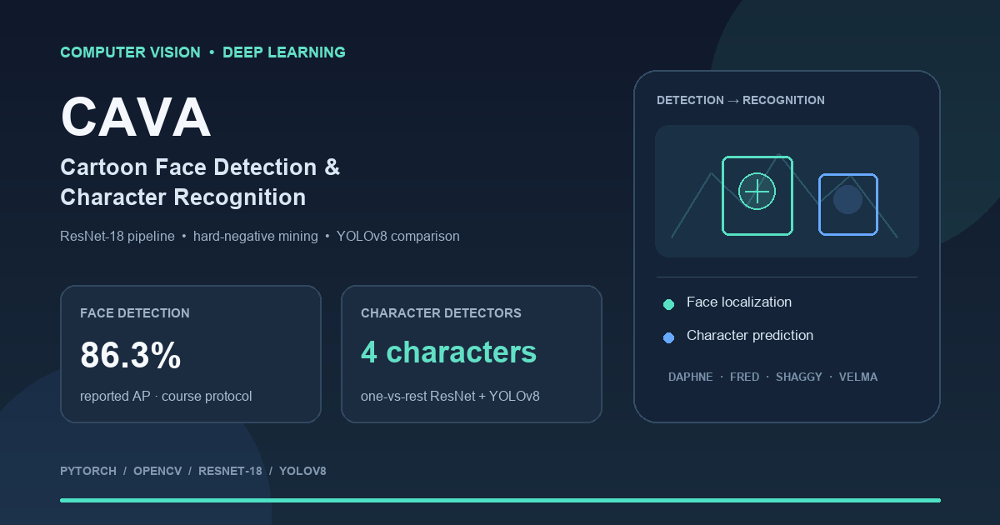
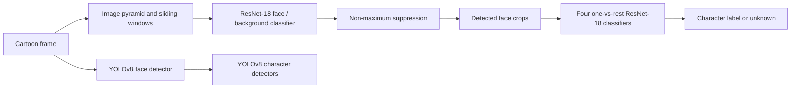

<div align="center">
  
</div>

# CAVA: Cartoon Face Detection and Character Recognition

**A computer vision pipeline for finding cartoon faces and identifying four Scooby-Doo characters.** This individual CAVA 2025 project compares a custom ResNet-18 detection-and-classification pipeline with YOLOv8 object detectors.

**PyTorch · Computer Vision · ResNet-18 · YOLOv8 · OpenCV · Hard Negative Mining**

## Results

The YOLOv8 bonus pipeline was evaluated on the course validation split with the supplied evaluator. It reached **86.3% average precision for face detection** after three training epochs. Its character detectors reached the following AP scores:

| Character | Average precision |
| --- | ---: |
| Daphne | 97.1% |
| Fred | 99.7% |
| Shaggy | 89.2% |
| Velma | 96.4% |

The evaluator uses Pascal VOC-style interpolated AP and counts a detection as a match at **IoU ≥ 0.30**. These scores are tied to that course protocol and should not be compared directly with COCO mAP or AP@0.5. The original report gives an approximate **50–60% AP** range for the ResNet sliding-window face detector; that result is approximate, so it is not presented at higher precision.

The validation data, trained checkpoints, and course evaluator are not included in this cleaned repository. The figures above are reported results from the original project run and cannot be independently reproduced from this copy alone.

## What the project does

1. **Detect faces.** A custom ResNet-18 classifies 64×64 RGB patches as face or background. A sliding-window search over image scales proposes candidate boxes; non-maximum suppression removes overlapping detections.
2. **Improve the detector.** Hard negative mining collects false-positive patches and feeds them back into training, targeting backgrounds that the current model finds confusing.
3. **Recognize characters.** Four binary one-vs-rest ResNet-18 classifiers score Daphne, Fred, Shaggy, and Velma. The recognition stage supports an unknown outcome when no character score is convincing.
4. **Compare with YOLOv8.** A separate bonus pipeline trains YOLOv8 detectors for face localization and character detection.



## Engineering work

- Implemented the ResNet-18 architecture and binary face detector in PyTorch, trained from scratch.
- Built multi-scale sliding-window inference and non-maximum suppression for face localization.
- Added hard negative mining to iteratively strengthen the face/background training set.
- Trained separate one-vs-rest character classifiers and used balanced sampling to address class imbalance.
- Prepared character-specific YOLO datasets by converting bounding boxes to normalized YOLO format and avoiding filename collisions across character folders.
- Evaluated detection quality with precision-recall curves and average precision on the course validation split.

## Repository structure

```text
solutie_fisiere/
├── src/task1/resnet/       # ResNet face detector, training, and hard-negative mining
├── src/task1/bonus/        # YOLOv8 face detection experiment
├── src/task2/one_vs_all/   # Character classifiers and training pipeline
├── src/task2/bonus/        # YOLOv8 character detection experiment
├── utils/paths.py          # Shared model and dataset paths
├── models/                 # Local checkpoints; not tracked
├── requirements.txt
└── environment.yml
```

## Run locally

The source is included, but this portfolio copy is **not a self-contained demo**. Training and inference require the course dataset and local model checkpoints; neither is distributed here. Obtain the dataset through the course's approved distribution, then follow [Dataset setup](DATASET_SETUP.md).

Create the Conda environment:

```bash
conda env create -f solutie_fisiere/environment.yml
conda activate cava_face_detection
```

Or use pip:

```bash
python3 -m venv .venv
source .venv/bin/activate
pip install -r solutie_fisiere/requirements.txt
```

The main entry points are:

- `solutie_fisiere/src/task1/resnet/train.py` — train the face/background classifier.
- `solutie_fisiere/src/task1/resnet/mine_hard_negatives.py` — mine hard negatives from images.
- `solutie_fisiere/src/task1/resnet/generate_results_resnet.py` — generate ResNet face detections.
- `solutie_fisiere/src/task2/one_vs_all/train_all_weighted.py` — train the four character classifiers.
- `solutie_fisiere/src/task2/one_vs_all/generate_results.py` — classify detected faces.
- `solutie_fisiere/src/task1/bonus/` and `solutie_fisiere/src/task2/bonus/` — YOLOv8 training and inference scripts.

Generated predictions and diagnostics go to the ignored `outputs/` directory. The expected checkpoint filenames are documented in `solutie_fisiere/utils/paths.py` and the model-folder README files.

## Data, models, and licensing

Course datasets, held-out test material, evaluation submissions, generated training runs, and model binaries are intentionally excluded. The original folder contained another student's evaluation submission; it was not copied here. Do not publish course test data, labels, or other students' work. The project uses Scooby-Doo character names and course-distributed cartoon imagery; follow the course rules for any dataset or image redistribution.

No open-source license was present in the original project, so this repository does not grant reuse rights yet. Add a license only after choosing the terms you want to offer.

## Author

**Mihnea Cucu** · [GitHub](https://github.com/MihneaCucu) · [LinkedIn](https://www.linkedin.com/in/mihnea-cucu/)
